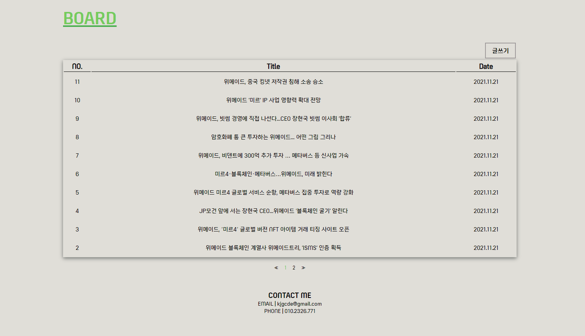
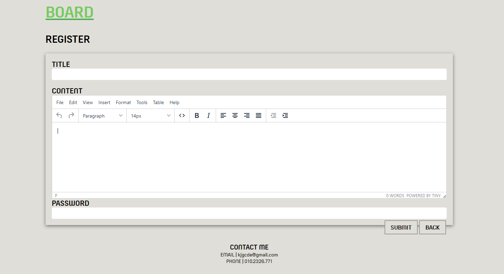
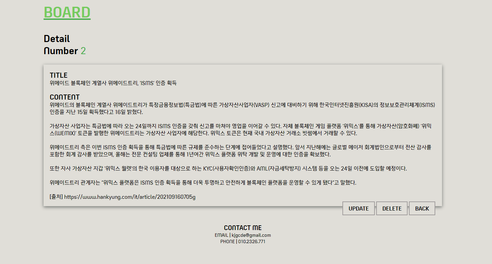
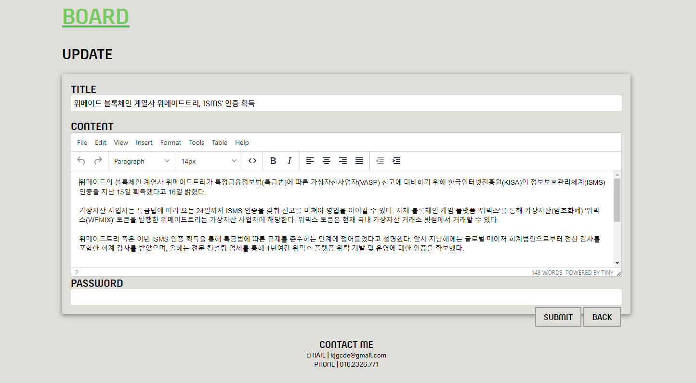

# BOARD FRONTEND

## 실행 명령어

### `yarn install`

- 패키지 설치

### `yarn start`

- React 실행
- http://localhost:3001

### `yarn build:[local|dev|prod]`

- Stage 별 Build 실행
- 산출물: **./build**

## 화면 예시

### < 메인화면 >

### < 등록화면 >

### < 상세화면 >

### < 수정화면 >

